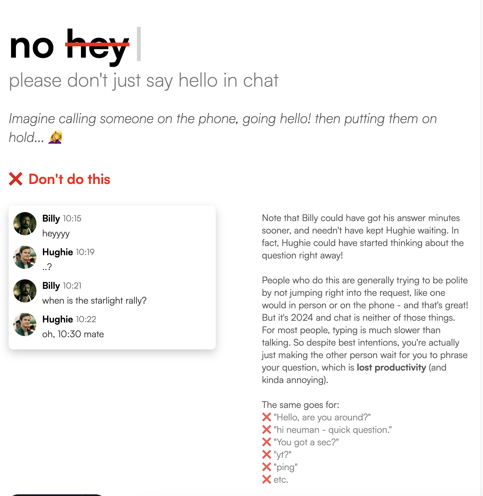

# NoHello



**NoHello** is a simple website inspired by [nohello.net](https://nohello.net), built to gently remind people to get to the point in chat messages, rather than starting with a simple "Hello" and then waiting for a response. The project is localized in multiple languages to ensure that the message reaches a global audience.

## Table of Contents

- [Features](#features)
- [Installation](#installation)
- [Usage](#usage)
- [Localization](#localization)
- [License](#license)

## Features

- **Multi-language support**: Automatically redirects users to a localized version of the site based on their IP address.
- **Responsive design**: Works on desktop, tablet, and mobile devices.
- **Dynamic content**: Localized greetings and explanations for why starting a chat with "Hello" isn't always the best approach.

## Installation

1. **Clone the repository:**
   ```bash
   git clone https://github.com/Naainz/nohello.git
   cd nohello
    ```

2. **Install dependencies:**
```bash
npm install
```

3. **Start the development server:**
```bash
npm run dev
```

4. Open `http://localhost:4321` in your browser.


## Usage

After cloning and setting up the project, you can customize content, styles, and available languages as needed. The site will automatically detect the user's IP and redirect them to the appropriate language version based on their country.

## Localization

The project currently supports the following languages:

- English (default)
- Spanish
- Russian
- Japanese
- Korean
- German
- French
- Greek
- Chinese
- Armenian
- Italian

If a user's IP address does not match any of these languages, they will be served the English site by default.


## License

This project is licensed under the [MIT License](LICENSE).

**NoHello** is not affiliated with [nohello.net](https://nohello.net) in any way. The project was created as a fun exercise in web development and localization. 

The code itself wasn't copied from the original project, but the general styling, and most of the text was heavily inspired by it. Profile pictures are characters from `The Boys` TV show. 